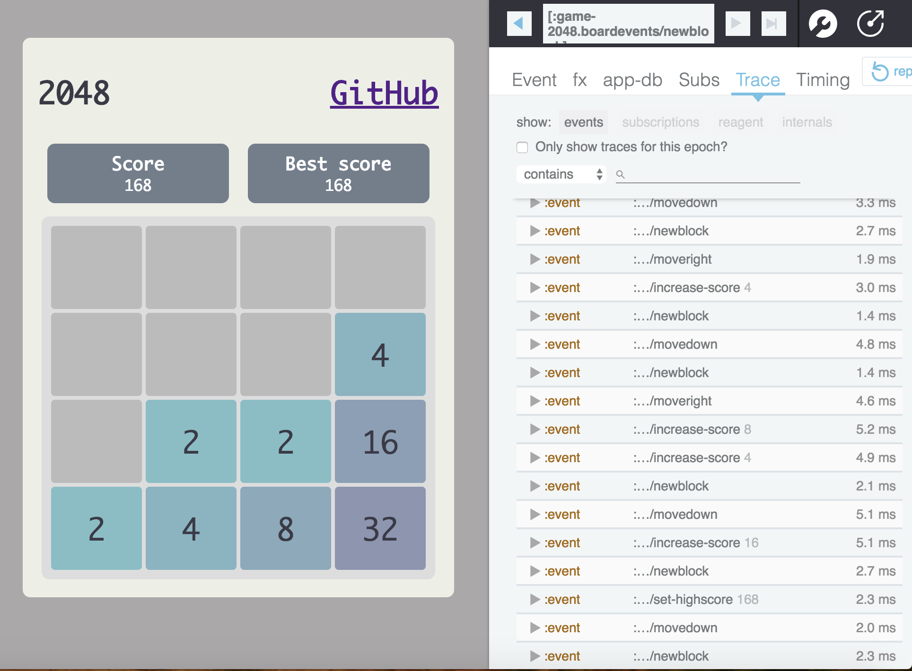
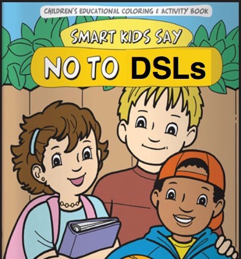
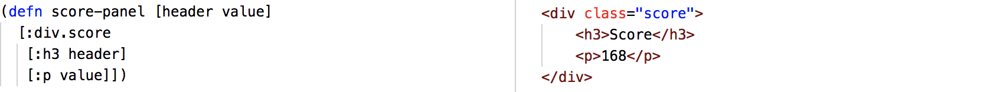
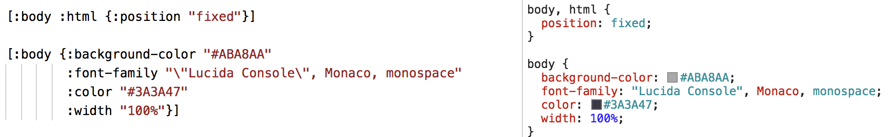
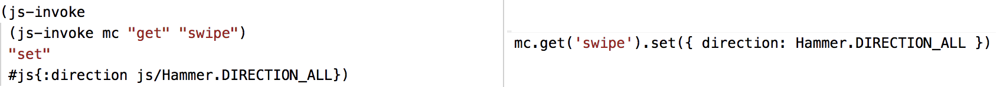

# Clojurescript 2048

[Checkout the live version](https://coens97.github.io/2048-clojurescript/)

This is my first Lisp application, written in Clojurescript. It is the popular 2048 game within the webbrowser, it works on phones and tablets through touch-events.

## Stack
 - Clojurescript
 - [reagent](https://github.com/reagent-project/reagent) `HTML`
 - [re-frame](https://github.com/Day8/re-frame) `Framework similar to React + Redux`
 - [Garden](https://github.com/noprompt/garden) `CSS`
 - [re-frame-10x](https://github.com/Day8/re-frame-10x) `Time travel debugger`

## DSL

The term domain-specific language (DSL) is very popular in Lisp. That is because Lisp easily allows to create a language to solve problems. It is not always the best solution in my oppinion. For example in this application HTML, CSS and JavaScript. It can be convenient with HTML to bind data to the UI. But less convenient when using a Javascript library without a clean wrapper. Take a look at the examples below.

### HTML

### CSS

### JavaScript
